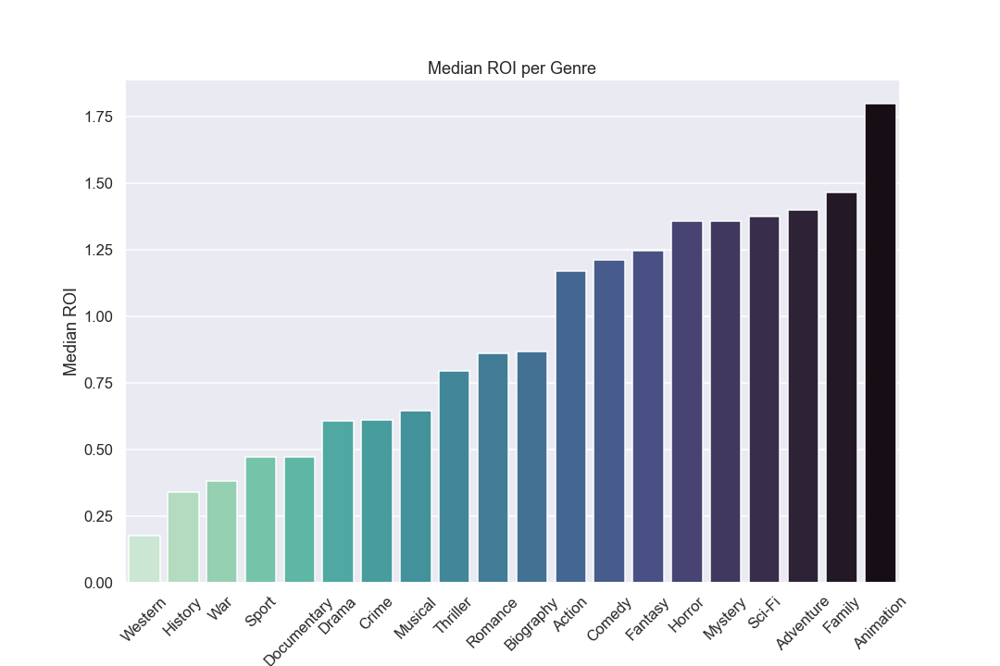

# Phase-2-Project
Primary repository for Cinemungers

## Project Overview
For this project, you will use data cleaning, imputation, analysis, and visualization to generate insights for a business stakeholder.

## Business Problem
Your company is expanding in to new industries to diversify its portfolio. Specifically, they are interested in purchasing and operating airplanes for commercial and private enterprises, but do not know anything about the potential risks of aircraft. You are charged with determining which aircraft are the lowest risk for the company to start this new business endeavor. You must then translate your findings into actionable insights that the head of the new aviation division can use to help decide which aircraft to purchase.

## The Data
In the data folder is a datasetLinks to an external site. from the National Transportation Safety Board that includes aviation accident data from 1962 to 2023 about civil aviation accidents and selected incidents in the United States and international waters.

It is up to you to decide what data to use, how to deal with missing values, how to aggregate the data, and how to visualize it in an interactive dashboard.

## Key Points
Your analysis should yield three concrete business recommendations. The key idea behind dealing with missing values, aggregating and visualizaing data is to help your organization make data driven decisions. You will relate your findings to business intelligence by making recommendations for how the business should move forward with the new aviation opportunity.

Communicating about your work well is extremely important. Your ability to provide value to an organization - or to land a job there - is directly reliant on your ability to communicate with them about what you have done and why it is valuable. Create a storyline your audience (the head of the aviation division) can follow by walking them through the steps of your process, highlighting the most important points and skipping over the rest.

Use plenty of visualizations. Visualizations are invaluable for exploring your data and making your findings accessible to a non-technical audience. Spotlight visuals in your presentation, but only ones that relate directly to your recommendations. Simple visuals are usually best (e.g. bar charts and line graphs), and don't forget to format them well (e.g. labels, titles).
 
## Deliverables
There are three deliverables for this project:

A non-technical presentation
A Jupyter Notebook
A GitHub repository
An Interactive Dashboard
