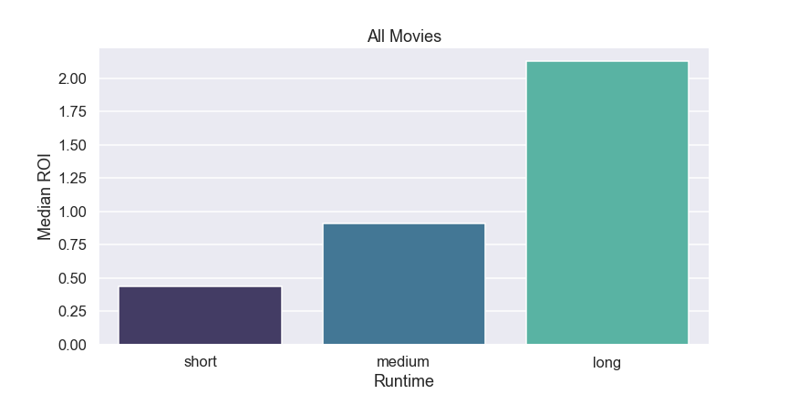

# IMDb Movie Analysis

## Overview
In this project, we conducted an analysis of thousands of movies to identify the key determinants of profitability. Our investigation looked into various factors, including genre, runtime, season of release, and the director's influence. Using Bayesian statistics, we used these trends to calculate the probability of a movie's success based on these factors.

## Business Understanding

Our new company is looking to enter the cinema and film industry. We were tasked with understanding what it takes to produce a film that's most likely to make money.

## Data Understanding and Analysis

### Sources of data present in the data folder: 

* [Box Office Mojo] (https://www.boxofficemojo.com/)
* [IMDB] (https://www.imdb.com/)
* [The Numbers] (https://www.the-numbers.com/)

### Description of data

Our initial dataset was comprised of over one hundred thousand movies, varying in data completeness. In light of this variance, we prioritized movies with information in our primary features. After data cleaning and research, our final dataset included attributes such as title, runtime (in minutes), director, studio, popularity votes, budget, worldwide gross profit, release month/season, and the crucial metric of total Return on Investment (ROI). The ROI was calculated as follows: ROI = (Gross Profit - Budget) / Budget, allowing us to gauge the financial performance of each film. We narrowed our focus exclusively to profitable movies and further refined our dataset by only considering films with a positive ROI. In our analysis, when evaluating ROI alongside each variable, our emphasis was on the median ROI due to its resilience against extreme values or outliers within the dataset.

We filtered out films with incomplete data, as well as outliers associated with two specific directors. To streamline our analysis, we transformed the genre data into a binary column, effectively quantifying the prevalence of each genre within our dataset. Interestingly, we observed that the majority of movies in our dataset fell under the Drama category. Nevertheless, in the context of ROI, Animation exhibited the most elevated median ROI.

Within the dataset, we pulled information regarding each film's release date. We also extracted the month from these dates and subsequently categorized the months into seasons as shown below:

* Spring: March 1st to May 31st
* Summer: June 1st to August 31st
* Autumn: September 1st to November 30th
* Winter: December 1st to February 28th

We noted the highest median ROI during the summer season. This is likely attributed to the trend of summer blockbusters, potentially stemming from the increased free time people tend to have during the summer months.

We categorized runtime into established time bins, where films with a duration of less than 40 minutes were classified as short films, those between 41 and 150 minutes fell within the average film length range, and films exceeding 150 minutes were deemed long films. Notably, long films consistently demonstrated a notably higher ROI.

We aimed to consider experience and minimize the influence of outliers on the data. Therefore, we only examined directors who had more than two films in the dataset. It's notable that the top three directors in our dataset were associated with films primarily in the adventure and family genres. This observation aligns with our genre-related findings.

Finally, we used Bayesian statistics to compute the probability of achieving a positive ROI (indicating a profitable movie) for each genre, director, runtime category, and season. The comprehensive results can be referenced in the accompanying Jupyter notebook. Here are some of the most noteworthy findings:

**Season**
Summer: 71.0% probability of a positive ROI

**Director**
Jon Favreau: 50.5% probability of a positive ROI

**Genre**
Animation: 87.0% probability of a positive ROI

**Runtime**
Movie Length > 150 Minutes: 75.0% probability of a positive ROI

For the complete results and detailed insights, please refer to the provided Jupyter notebook. 

## Conclusion
Our recommendation for the new company is to concentrate on producing an extended-length animation film with a notable director, such as Jon Favreau. We also suggest scheduling its release during the summer months. Our analysis shows the summer season as particularly lucrative for movie releases, fueled by the trend of summer blockbusters. Our findings emphasize that longer films consistently generate higher ROIs, while top-performing directors tend to gravitate towards adventure and family genres. Notably, animation emerges as the genre with the highest probability of delivering a profitable movie.
